**ANALYSIS OF THE DATA EXTRACTED FROM AN ENGINEERING DRAWING** 

**PROBLEM STATEMENT:** 

CAD Analytics refers to the process of extracting, analyzing, and interpreting data from Computer-Aided Design (CAD) files (like DWG, DXF, or STEP formats). It leverages analytical tools and algorithms to gain insights from CAD drawings and models for better decision-making in engineering, manufacturing, architecture, and other related fields. CAD Analytics bridges the gap between design and data analysis, offering powerful insights to improve efficiency, cost, and accuracy in projects across various industries. 

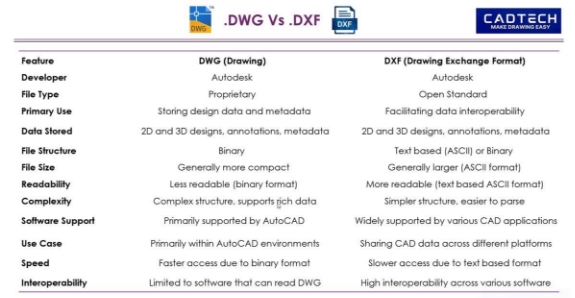

In this project we have predominantly worked with 2D CAD files (.dwg, .dxf and .pdf files) i.e. engineering drawings and tried to follow the methodology given below: 

- **Data Extraction**: Extract geometric, annotation, and metadata information from CAD files (DWG, DXF, STEP, etc.). 
- **Metadata Analysis**: Analyze layers, dimensions, units, materials, and object properties. 
- **Dimensional Analysis**: Measure lengths, areas, volumes, and perform geometric calculations. 
- **Bill of Materials (BOM) Extraction**: Extract part lists, quantities, and materials from CAD drawings. 

**WORK APPROACH:** 

1. **AutoCAD Data Extraction** 

A file named hydraulic\_unit.dwg is opened in AutoCAD and data is extracted from the drawing using the Data Extraction Wizard. 

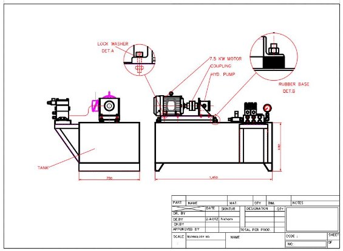

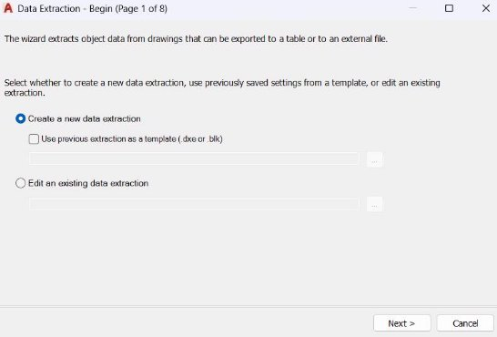

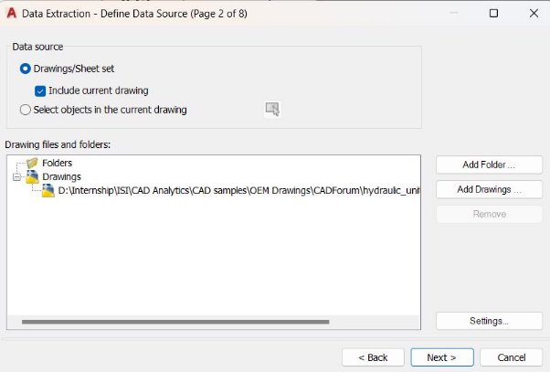

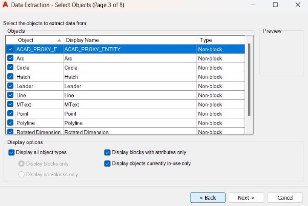

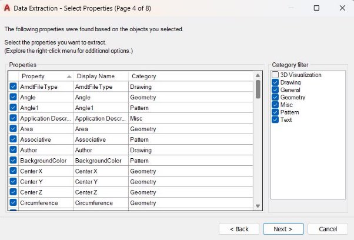

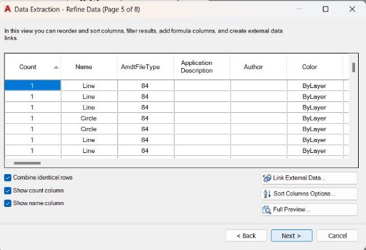

At last export the data as .xls file. 

Eliminate unnecessary columns to show only the required attributes. 

2. **Analysis of the extracted data** 

After manually comparing the extracted data with the drawing, it has been observed that there has been some unnecessary data. After removing some empty columns, the data still looks complicated. 

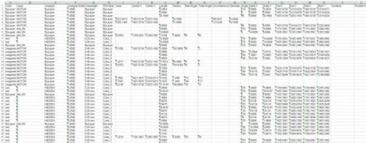

At the end, we will get to know about the coordinates and the contents of the drawing attributes like Line, Arc, MText, etc properly. 

**Difficulty faced:** To recognize the text contents (MText) in such a big collection of data 

**Possible approach:** Websites like[ https://ocr.space/ ](https://ocr.space/)has been used to extract the text data from the drawing pdf which might be easily readable and user friendly. 

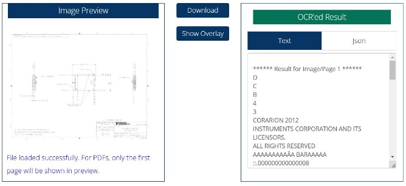

3. **Emphasis on the technical aspects** 

**Difficulty faced:** Important technical information about the drawing is missing 

**Possible approach:** Refer to OEM catalogues in[ https://www.3dfindit.com/en/ ](https://www.3dfindit.com/en/)for better understanding of the technical data in the OEM drawings 

Let us take an example of a Slip Clutch Hub 

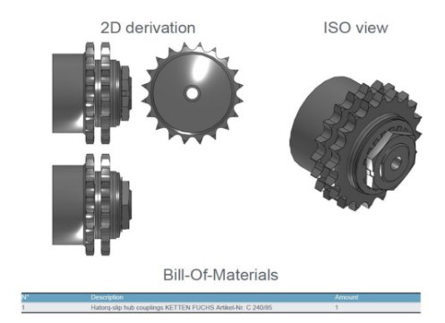

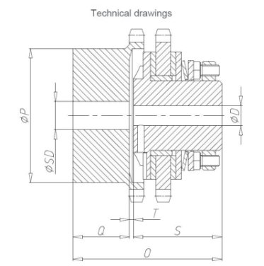

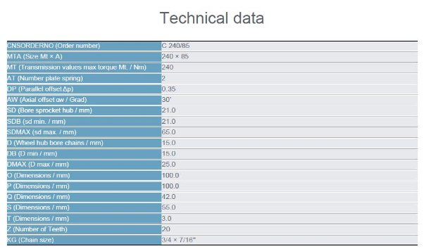

` `The above table clearly shows the technical data about the OEM in an organized manner. Hence a similar approach has been undertaken for the AutoCAD data extraction of the above drawing file and the results are below. 

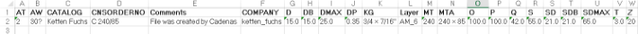

After the thorough analysis of the CAD data, we arrive at the conclusion that predominantly we need to extract 2 types of data – Mtext (consists of Author, Drawing no., Scale, Date, Size, Organization Name, Units, etc which are present in the bottom right corner generally) and Technical data as shown in the above table. 

Therefore the final solution is to develop a tool such that it can extract both these data simultaneously in an organized and user-friendly manner. The tool should support either .dwg, .dxf or .pdf files. 

**WORK PRODUCTS AND DELIVERABLES:** 

**Software used for Data Extraction:** AutoCAD 2019 **IDE:** Visual Studio Code 

**.DWG to .DXF Converter:** TeighaFileConverter 4.3.2 **Documentation:** 1.[ https://ezdxf.readthedocs.io/en/stable/ ](https://ezdxf.readthedocs.io/en/stable/)

2. [https://pypi.org/project/ezdxf/ ](https://pypi.org/project/ezdxf/)
2. [https://docs.streamlit.io/ ](https://docs.streamlit.io/)

**Websites of Original Equipment Manufacturers (OEMs):** 

1. [https://siemens.partcommunity.com/3d-cad-models/?cwid=0433 ](https://siemens.partcommunity.com/3d-cad-models/?cwid=0433)
1. [https://www.3dfindit.com/en/cad-bim-library/manufacturer/eatons- cad?path=eaton_cad ](https://www.3dfindit.com/en/cad-bim-library/manufacturer/eatons-cad?path=eaton_cad)
1. [https://www.3dfindit.com/en/cad-bim-library/manufacturer/abb?path=abb ](https://www.3dfindit.com/en/cad-bim-library/manufacturer/abb?path=abb)
1. [https://www.hermanmiller.com/resources/3d-models-and-planning- tools/planning-ideas/ ](https://www.hermanmiller.com/resources/3d-models-and-planning-tools/planning-ideas/)
1. [https://www.kohler.com/en/for-professionals/technical-specifications ](https://www.kohler.com/en/for-professionals/technical-specifications)
1. [https://www.mitsubishielectric.com/fa/download/cad/ ](https://www.mitsubishielectric.com/fa/download/cad/)
1. [https://www.se.com/us/en/download/doc-group-type/120245927022- CAD,+Drawings,+&+Curves/ ](https://www.se.com/us/en/download/doc-group-type/120245927022-CAD,+Drawings,+&+Curves/)
1. [https://www.ni.com/en/support/documentation/dimensional- drawings.html ](https://www.ni.com/en/support/documentation/dimensional-drawings.html)
1. [https://oem-bike-parts.com/en/ ](https://oem-bike-parts.com/en/)
1. [https://www.3dcontentcentral.com/parts/supplier/Saint-Gobain- Performance-Plastics.aspx ](https://www.3dcontentcentral.com/parts/supplier/Saint-Gobain-Performance-Plastics.aspx)

**Websites of CAD (Computer Aided Design) Communities:** 

1. [https://www.cadforum.cz/catalog_en/ ](https://www.cadforum.cz/catalog_en/)
1. [https://www.3dfindit.com/en/cad-bim-library/ ](https://www.3dfindit.com/en/cad-bim-library/)
1. [https://www.3dcontentcentral.com/ ](https://www.3dcontentcentral.com/)

**Websites used for Metadata Extraction:**  

1. [https://products.aspose.app/cad/metadata ](https://products.aspose.app/cad/metadata)
1. [https://products.groupdocs.app/metadata/total ](https://products.groupdocs.app/metadata/total)
1. [https://ocr.space/ ](https://ocr.space/)

**Github Repository Link: [https://github.com/coding-with-parthasarathi/CAD-Analytics ](https://github.com/coding-with-parthasarathi/CAD-Analytics)**

**USER MANUAL:** 

1. Open Command Prompt. 

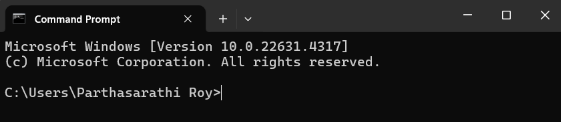

2. Navigate to the project directory by typing **cd myapp**. 

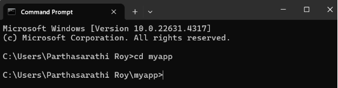

3. Activate the python virtual environment (venv) by typing **venv\Scripts\activate.bat**. 

   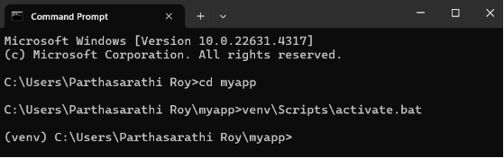

4. Run the **cad\_data.py** file by typing **streamlit run cad\_data.py**. 

   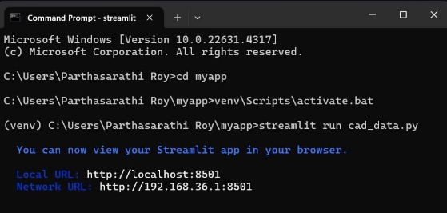

5. The Streamlit app will automatically open in the browser or you can follow the above URLs to open the app. 

6. Next we have to upload a DXF file by clicking on Browse Files and the data extracted from the file will be shown below. 

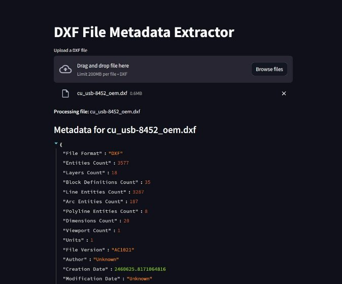

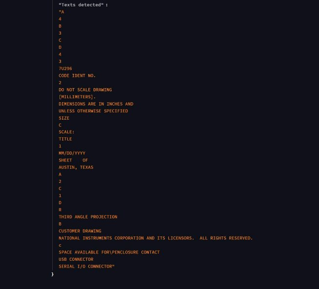

**Note:** If we need to extract data from a DWG file, it needs to be converted first to DXF file. The steps to do the same are as follows: 

1. Open TeighaFileConverter 4.3.2. 
1. Select the input and the output folders. 
1. Select the input file filter as \*.DWG. 
1. Select the output version as 2018 ASCII DXF. 
1. Check the Audit checkbox. 
1. Click on Start to start the conversion. 
1. The converted DXF file will be saved in the output folder. 

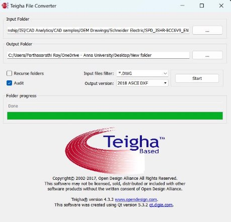

The converted DXF file is then uploaded in the DXF File Metadata Extractor App and the necessary data is fetched as shown below. 

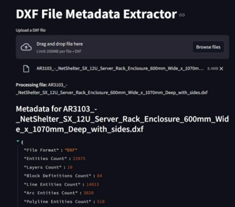

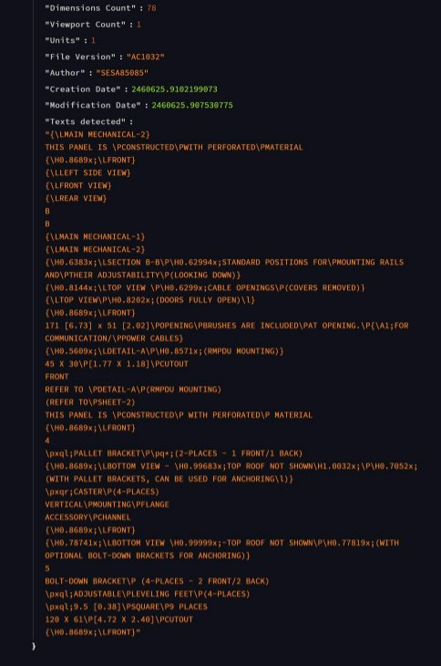

**Note:** The data extraction might not be accurate but this app is able to extract some amount of data from the uploaded DXF file.   

**TECHNICAL MANUAL:** 

**Datasets:** 1.[ https://github.com/coding-with-parthasarathi/CAD- Analytics/tree/main/OEM%20Drawings ](https://github.com/coding-with-parthasarathi/CAD-Analytics/tree/main/OEM%20Drawings)

2\.[ https://github.com/coding-with-parthasarathi/CAD-](https://github.com/coding-with-parthasarathi/CAD-Analytics/tree/main/Extracted%20Metadata)

[Analytics/tree/main/Extracted%20Metadata ](https://github.com/coding-with-parthasarathi/CAD-Analytics/tree/main/Extracted%20Metadata)

**Python libraries:** Streamlit, ezdxf **Program documentation:** Program name: cad\_data.py 

|**Function Name** |**Purpose** |
| - | - |
|def extract\_metadata\_from\_dxf(file): |Extract metadata from a DXF file using ezdxf |
|def process\_dxf(file): |To check if it is a .dxf file |

Source code:[ https://github.com/coding-with-parthasarathi/CAD- Analytics/blob/main/cad_data.py ](https://github.com/coding-with-parthasarathi/CAD-Analytics/blob/main/cad_data.py)

**Prerequisites:** 

As with any programming tool, in order to install Streamlit you first need to make sure your computer is properly set up. More specifically, you’ll need: 

1. Python [(version 3.8 to 3.12.](https://www.python.org/downloads/)) 
1. A Python environment manager (recommended) 

   Environment managers create virtual environments to isolate Python package installations between projects.  

   For this guide, we'll be using **venv**, which comes with Python. 

3. A Python package manager 

   Package managers handle installing each of your Python packages, including Streamlit. 

   For this guide, we'll be using **pip**, which comes with Python. 

4. Only on MacOS: Xcode command line tools 

   Download Xcode command line tools using[ these instructions ](https://mac.install.guide/commandlinetools/4.html)in order to let the package manager install some of Streamlit's dependencies. 

5. A code editor 

Most preferable editor is[ VS Code.](https://code.visualstudio.com/download) **Installation and configuration guide:** 

1. Open Command Prompt and clone the given Github repository: 

   git clone[ https://github.com/coding-with-parthasarathi/CAD-Analytics.git ](https://github.com/coding-with-parthasarathi/CAD-Analytics.git)

2. Navigate to the project directory: 

   cd CAD-Analytics 

3. In the terminal type: 

   python -m venv .venv 

4. A folder named "venv" will appear in your project. This directory is where your virtual environment and its dependencies are installed. 
4. Activate the virtual environment: 

   venv\Scripts\activate.bat 

6. Once activated, you will see your environment name in parentheses before your prompt. "(venv)" 
6. Install streamlit: 

   pip install streamlit 

8. To deactivate the virtual environment type: 

   deactivate 

9. Install ezdxf which is a Python package to create new DXF files and read/modify/write existing DXF documents: 

   pip install ezdxf 

10. Repeat step 5. 
10. Run the cad\_data.py file by typing: 

    streamlit run cad\_data.py 

12. Carry out the rest of the work in the Streamlit app by referring to the User Manual. 
